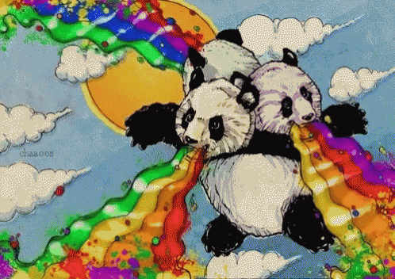
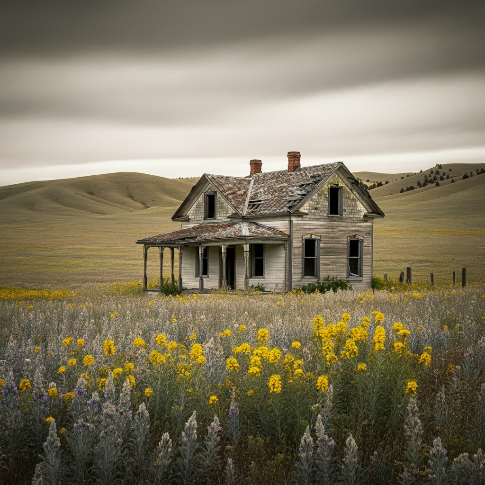
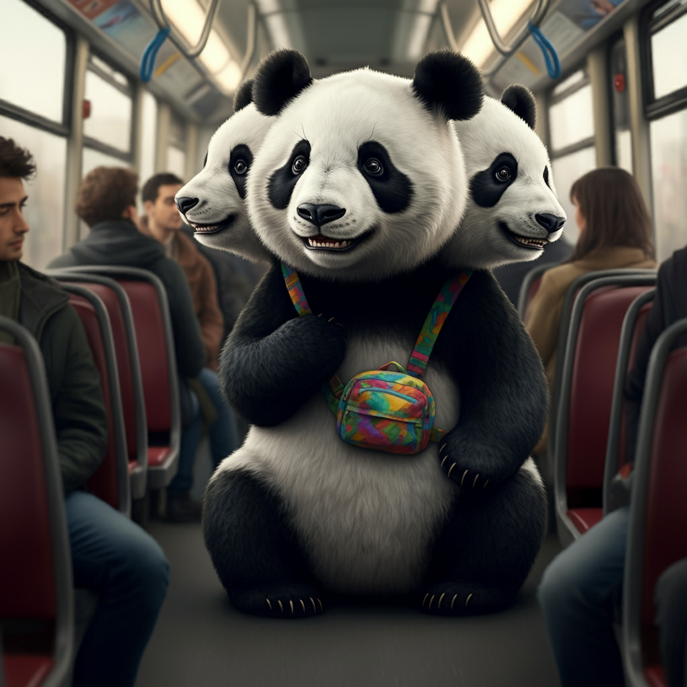

# Three-headed Panda {#panda .small data-auto-animate="true" }

## Three-headed Panda {#panda .small data-auto-animate="true"}

::: leftcol

:::
## Three-headed Panda {#panda .small data-auto-animate="true"}

::: leftcol

:::

::: {.rightcol .larger}
Who will be my three-headed panda today?
:::

# Rules {#rules .fragment .animated .move-to-middle-top .invisible background-image="../images/rules.gif"  data-transition="zoom" data-background-size="contain"}

## Rules

[1.  When I say \"Class,\" you say \"Yes?\"]{.fragment .highlight-current-red}\
[2.  When I say a fact, you say something like \"Ohh\", \"Wow!\", \"Marvelous!\"]{.fragment .highlight-current-red}\
[3.  Pay attention]{.fragment .highlight-current-red}\
[4.  Be nice to me and others]{.fragment .highlight-current-red}\
[5.  If you speak Chinese 4 times, I may give you homework ¯\\~(ツ)~\_/¯]{.fragment .fade-up .large style="color:red;"}\

# ¯\\~(ツ)~\_/¯ {style="color:yellow;font-size:50%" data-auto-animate="true"}

(My face when I give you homework after you speak Chinese four times)

# ¯\\~(ツ)~\_/¯ {style="color:yellow;font-size:150%" data-auto-animate="true"}

(My face when I give you homework after you speak Chinese four times)

# English Ear {#english-ear background-image="../images/penguin-ear.gif" data-background-size="contain" data-transition="zoom" .transparentbox}

# Last time {background-image="../images/off-to-school.gif" data-background-size="contain" data-transition="zoom" .transparentbox}

# Vocabulary {#vocabulary background-image="../images/vocabulary.gif" data-background-size="contain" data-transition="zoom" .invisible}

## Vocabulary 

[1. by \[thing\]]{.fragment .highlight-current-red}\
[2. before/after]{.fragment .highlight-current-red}\
[3. near to/far from]{.fragment .highlight-current-red}\
[4. get on/get off]{.fragment .highlight-current-red}\

# Quiz {#quiz background-image="../images/quiz.gif" data-background-size="contain" data-transition="zoom" .invisible}

# Quiz {#quiz-1}
[1. I usually travel to school []{.fill-in-the-blank}.]{.fragment .fade-in-then-out}\
[2. We like to eat lunch []{.fill-in-the-blank} we finish our classes.]{.fragment .fade-in-then-out}\
[3. My friend lives []{.fill-in-the-blank} the park, so we visit often.]{.fragment .fade-in-then-out}\
[4. It’s not easy to []{.fill-in-the-blank} the train if it’s too crowded.]{.fragment .fade-in-then-out}\
[5. Can you tell me how you go home []{.fill-in-the-blank} school?]{.fragment .fade-in-then-out}\

## Quiz {#quiz-2}

[1. I always feel excited []{.fill-in-the-blank} a long trip.]{.fragment .fade-in-then-out}\
[2. The bus stop is []{.fill-in-the-blank} my house, just a short walk away.]{.fragment .fade-in-then-out}\
[3. When I []{.fill-in-the-blank} the bus, I like to find a window seat.]{.fragment .fade-in-then-out}\
[4. I prefer to travel []{.fill-in-the-blank} a bike instead of a car.]{.fragment .fade-in-then-out}\
[5. We usually play outside []{.fill-in-the-blank} we finish our homework.]{.fragment .fade-in-then-out}\

# Discussion

What is the best way to travel? 

By car? By bus? By rocket? By coffee cup?

[**Why?**]{.larger .fragment .highlight-red}

# Story Time {#story-time background-image="../images/chubbicorns.gif" data-background-size="contain" data-transition="zoom" .transparentbox}

## Today

## Far from the school, where pigs fly {#famously-pretty-countryside .transparentbox background-image="../images/dancing-tree.gif" data-background-size="contain"}

::: leftcol

:::

## Far from the school 

::: leftcol

:::

::: {.rightcol .larger}
Where the three-headed panda student lives.
:::

# How does our panda get to school? 

[by bus?](#by-bus) [by grandma?](#by-grandma) [on foot?](#on-foot)

## By grandma 
::: leftcol
{style="object-fit:contain;"}
:::

::: {.rightcol .large style="margin-top:15%"}
Grandma carries the panda
:::
## By bus 
::: leftcol
{style="object-fit:contain;"}
:::

::: {.rightcol .large}
[The three-headed panda talks to a friend with each head.]{style="padding-top:15%;margin-left:15px;"}
:::
## On foot 
::: leftcol
{.r-stretch style="object-fit:contain;"}
:::

::: {.rightcol .large style="margin-top:10%"}
He is very tired from walking so far from home. 
:::

# What are the rainbows for? {background-image="../images/rainbow-panda.gif" .transparentbox}

