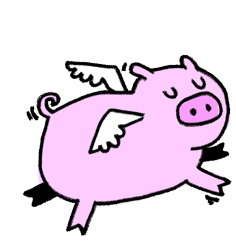

# Cool Unicorn {#cool-unicorn-1 .invisible data-auto-animate="true"}
{.ltr}

<!--  -->

<!-- # Test -->
<!-- [hello]{.glitch title="hello"} -->

## Cool Unicorn {#cool-unicorn-2 .invisible}

{.ltr}

Wow! What a cool unicorn.

[what a cool uniino]{.scale-up}

# Rules {#rules .animated .move-to-middle-top .invisible background-image="../images/rules.gif"  data-transition="zoom" data-background-size="contain"}

## Rules

1.  When I say \"Class,\" you say \"Yes?\"
2.  When I say a fact, you say something like \"Ohh\", \"Wow!\", \"Marvelous!\"
3.  Pay attention
4.  Be nice to me and others
5.  If you speak Chinese 4 times, I will give you homework ¯\\~(ツ)~\_/¯

# Last time {background-image="../images/off-to-school.gif" data-background-size="contain" data-transition="zoom" .transparentbox}

# English Ear {#english-ear background-image="../images/penguin-ear.gif" data-background-size="contain" data-transition="zoom" .transparentbox}

# Vocabulary {#vocabulary background-image="../images/vocabulary.gif" data-background-size="contain" data-transition="zoom" .invisible}

## Vocabulary 

[1. famous]{.fragment .highlight-current-red}\
[2. countryside]{.fragment .highlight-current-red}\
[3. during]{.fragment .highlight-current-red}\
[4. pretty/handsome]{.fragment .highlight-current-red}\

# Quiz {#quiz background-image="../images/quiz.gif" data-background-size="contain" data-transition="zoom" .invisible}

# Quiz {#quiz-1}

[1.  The artist became  after painting a mural that everyone loved.]{.fragment .fade-in-then-out}\
[2.  We went for a walk in the  to see the beautiful flowers and animals.]{.fragment .fade-in-then-out}\
[3.   the summer, I like to go swimming in the lake.]{.fragment .fade-in-then-out}\
[4.  My neighbor is very ; people often ask him for fashion advice.]{.fragment .fade-in-then-out}\
[5.  The  landscape was filled with rolling hills and bright blue skies.]{.fragment .fade-in-then-out}\

# Quiz {#quiz-2}

[1.  She sang beautifully  the concert, and everyone clapped.]{.fragment .fade-in-then-out}\
[2.  My sister has a  smile that makes everyone happy.]{.fragment .fade-in-then-out}\
[3.  The  farm was famous for its delicious apples.]{.fragment .fade-in-then-out}\
[4.  He was  because of his charming personality and good looks.]{.fragment .fade-in-then-out}\
[5.  We like to have picnics in the  whenever the weather is nice.]{.fragment .fade-in-then-out}\

# Discussion

Do famous people live in the countryside?

# Story Time {#story-time background-image="../images/chubbicorns.gif" data-background-size="contain" data-transition="zoom" .transparentbox}

## Today

{.ltr-noflip}

Who is my very cool unicorn?

## Famously pretty countryside {#famously-pretty-countryside .transparentbox background-image="../images/dancing-tree.gif" data-background-size="contain"}

{.rtl .smallest style="margin: -20% 0 0 30%; display:inline-block;"}

{.rtl .smallest style="margin: -20% 0 0 -30%; display:inline-block;"}

{.rtl .smallest style="margin: -20% 0 0 0; display:inline-block;"}

{.rtl .smallest style="margin: -20% 0 0 30%; display:inline-block;"}

{.rtl .smallest style="margin: -20% 0 0 -30%; display:inline-block;"}

{.rtl .smallest style="margin: -20% 0 0 0; display:inline-block;"}

## Rainbow sneezing {#rainbow-sneezing .invisible background-image="../images/rainbow.png" data-background-size="contain" data-visibility="hidden"}

## Rainbow sneezing {#rainbow-sneezing-1 .invisible background-image="../images/sneeze.gif" data-background-size="contain" data-visibility="hidden"}

## Rainbow sneezing {#rainbow-sneezing-2 .invisible background-image="../images/chubbicorns.gif" data-background-size="contain" data-visibility="hidden"}

