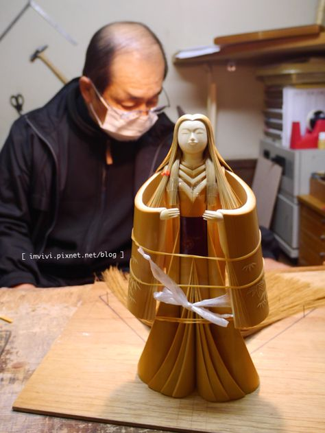
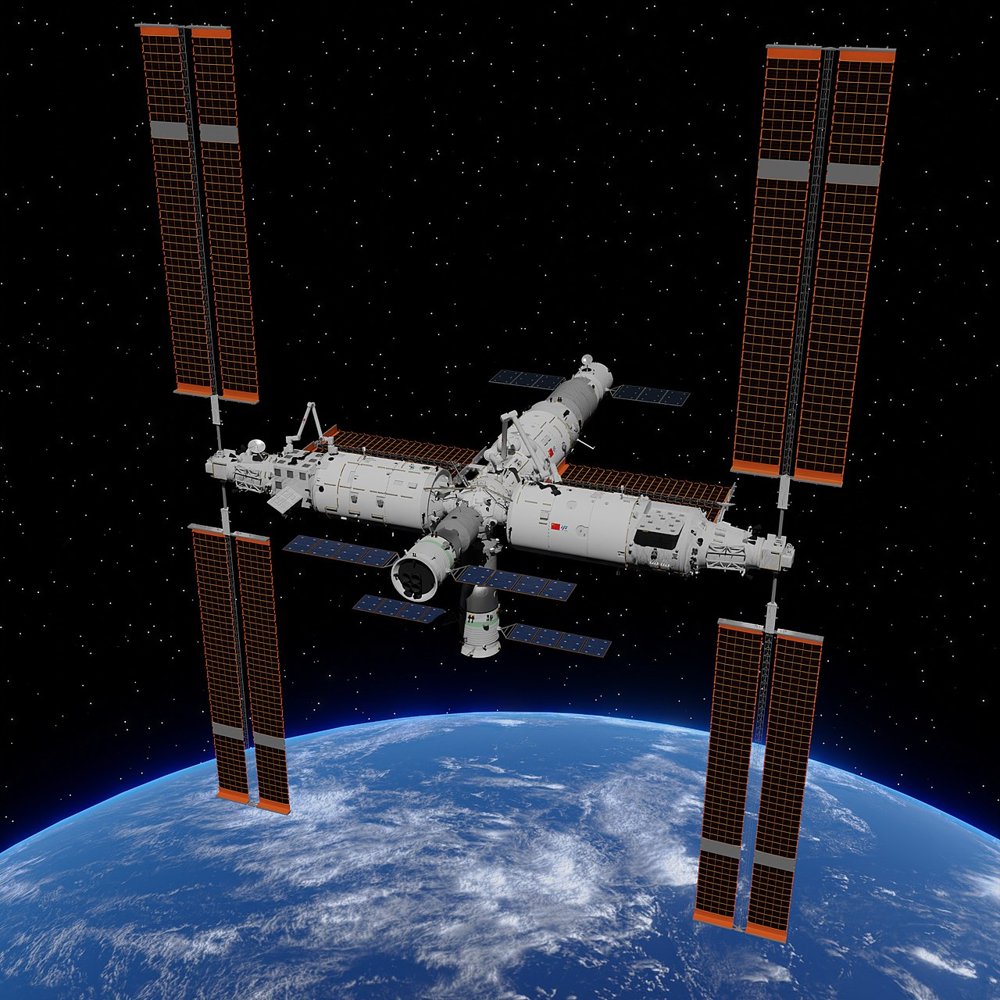

# Rules {data-auto-animate="true"}
## Rules {data-auto-animate="true"}
1. When I say “Class,” you say “Yes?”
1. When I tell you something, you say “Ohhh” 😯
1. No doing homework
1. No sleeping 😴

# We're gonna watch a video
## Things to Know
would rather 
: prefer

prefer
: 更喜欢

# [Note Block Battle](https://www.bilibili.com/video/BV1Ai4y137Si/)
# Questions
## Questions 
1. What happened in the video?
2. Who is the best musician?
3. What game does this come from? 
4. Where does the video take place? 
5. Who are the characters in the video? 
6. Who are the main characters?
8. What was the orange one trying to do?
9. Why did the orange one get out of bed?
10. Why did the green stick figure get mad? 
11. Would you rather listen to the chicken or the green stick figure? 

# Stories 
## Pick a Story
:::{.center-text}
[C2-Story](#C2-Story)

[C5-Story](#C5-Story)

[C6-Story](#C6-Story)

[C7-Story](#C7-Story)

[C8-Story](#C8-Story)
:::

## C2 Story
:::{.story}
We have no story yet 😥
:::

## C5 Story
:::{.story .leftcol}
There is a student named Thea. Thea is in a small house in a forest. One day, Thea wants to see animals in the forest. She sees elephants, lions, cats, and a panda. Oh no! The animals see Thea. The panda sees Pacino in the forest. It tries to eat Pacino (Pacino is bamboo). 
:::

:::{.story .rightcol}

:::

## C5 Story
:::{.story .leftcol}
Thea goes to the forest center and finds a castle. The castle has a *moat* (a river). There are crocodiles (!!) in the river! The crocodiles see her and they want to eat her. Thea does not want to be crocodile food. Thea *punches* the crocodile and runs away.
:::

<video width="400" height="100%" src="../videos/Crocodile-Fight.mp4" controls></video>

## C5 Story
:::{.story .leftcol}
*OH NO!* Now there's a storm! The storm breaks the castle's walls! Don't worry! Thea has a friend who is magic robot: Magic Robot Kobe Bryant! She calls him to help her and help Pacino (*in the panda's stomach*):
:::

:::{.story .rightcol}

:::

## What does she say?
:::{.fragment .fade-up .centered}
"KOBE KOBE KOBE!"
:::

:::{.fragment .fade-up}
Magic Robot Kobe Bryant appears and says "*I have a spaceship in the mountains! I will carry you there!*"
:::

## To space!
:::{.leftcol}
Magic Robot Kobe Bryant carries them on his back to the mountains! They get on his spaceship and fly to 天宫. Now they are in space. 
:::

:::{.rightcol}

:::

## Oh no...
:::{.story}
*But there is a problem!*

MRKB lost his dog!
:::

## C6 Story
:::{.story}
There is a student named Kobe Bryant. Kobe Bryant is in a small house in a forest. Kobe Bryant goes from his house into the forest. He sees some monkeys! The monkeys say "ooh ooh ah ah!" and scare Kobe Bryant!  Kobe Bryant is so scared that he cries. Justin Bieber hears him crying. Justin Bieber (171 cm) *carries* Kobe Bryant (195 cm) so far! Justin Bieber *carries* Kobe Bryant to the mountains! When they get to the top of a mountain Justin Bieber throws Kobe Bryant into the sea. But Kobe is magic! He flies out of the sea to Justin Bieber's castle! *(Justin Bieber lives in a castle)*
:::

## In Bieber's Castle
:::{.story}
Shann is in Justin Bieber's castle. *OH NO!* a storm *destroys* the castle! Shann is *in trouble*! But Kobe Bryant is there, and he is a robot! Magic Robot Kobe Bryant gives Shann a wish. Shann wishes to go away from the storm that *destroyed* Justin Bieber's castle. Shann wishes to be in the mountains. Magic Robot Kobe Bryant also gave Coco a wish. Coco wished that the school would not have homework. Then another student wished that the school would not have teachers!
:::

## To the Sea!
:::{.story}
Teacher Darris wants them to move to the sea, so Kobe Bryant, Coco, Justin Bieber, and Shann jump off the mountain into the sea. The monkeys do not follow them. They do not have swimming suits. A blue whale eats them. *Are they scared?* The blue whale can fly too! It flies back to Justin Bieber's castle. But it is bad at flying and it crashes.

Kelly was walking and she saw the flying blue whale. She was so hungry. She followed the blue whale and she saw it crash into the castle. She runs to the whale, adds salt, and starts eating the whale. 
:::

## C7 Story
:::{.story}
There is a student named Ryan. Ryan is in a small house in a forest. Ryan goes into the forest, but he does not like it, so he goes back. *Who is there?* Andrew is waiting in the bedroom. Linda is walking in the forest, and she sees Ryan's house. She sees Ryan and Andrew playing football in Ryan's bedroom. She **HATES** football, she only likes videogames, so she turns around and walks away. *Oh no!* She turned around and now Andrew and Ryan are playing videogames! *OH NO!* now there is a thunderstorm! Linda runs back to the house! It is so powerful that it takes the roof off the house! They have to get out of the storm!
:::

## Getting out of the Storm
:::{.story}
Linda's friend, Magic Robot Kobe Bryant saves them! Magic Robot Kobe Bryant has a *nuke* and a *spaceship*. He puts Linda, Ryan, and Andrew on his back and carries them to the mountains. Why to the mountains? Because he has a spaceship there. Magic Robot Kobe Bryant, Linda, Andrew, and Ryan get into the spaceship and fly into space! To Tiangong! 

From Tiangong, Magic Robot Kobe Bryant gives the class five (so many...) wishes: 
:::

## The Wishes
:::{.centered}
1. Magic Robot Kobe Bryant is now the head teacher
2. Head Teacher Magic Robot Kobe Bryant tells the other teachers that students can do whatever they want.
3. Head Teacher Magic Robot Kobe Bryant gives $100 million every day they go to school.
4. Head Teacher Magic Robot Kobe Bryant says students do not have to go to school.
5. Head Teacher Magic Robot Kobe Bryant says no more homework!
:::

## C8 Story
:::{.story}
There is a student named Chloe. Chloe is in a small house in a forest. One day, Chloe goes into the forest. Chloe found Edward doing archery in the forest. He's *shooting at* Charlie. Charlie is standing still and he *dodges, just in the nick of time*. Lisa is a beautiful princess in a tower near Edward. She's in the tower because Edward put her there (mean boy [actually very nice]). BUT! Lisa is a ninja princess, she jumps down from the tower window and attacks ***Bruce Lee [李小龍] noise*** Charlie with a ninja knife.
:::

## To Tiangong!
:::{.story}
Chloe calls Magic Robot Kobe Bryant (KOBE! KOBE! KOBE!) and he gives Chloe a wish. She asks Magic Robot Kobe Bryant to carry Lisa, Charlie, Edward, Daisy, and her to space. They go above the storm, soooo far, all the way to Tiangong! At Tiangong, Edward uses Tiangong's *secret weather magic* to stop the *hurricane*. 
:::

## Two More Wishes
:::{.story}
When they get back to school, Magic Robot Kobe Bryant gives the class two more wishes:

:::{.centered}
1. No homework;
2. A stronger roof for the school.
:::

