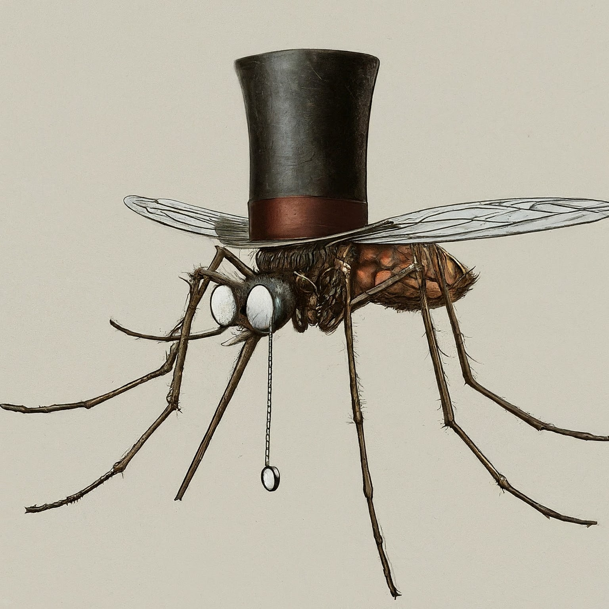

::: {.REVEAL_PROPERTIES .drawer}
```{=org}
#+STARTUP: indent fold
```
```{=org}
#+REVEAL_INIT_OPTIONS: hash: true
```
```{=org}
#+REVEAL_SLIDE_HEADER: <span class="questionwords">¿Dónde?<br>在哪里？</span> <span class="questionwords">¿Por qué?<br>为什么？</span> <span class="questionwords">¿Cómo?<br>如何？</span>
```
```{=org}
#+REVEAL_SLIDE_FOOTER:<span class="questionwords">¿Quién? <br>谁?</span> <span class="questionwords">¿Qué?<br>什么？</span> <span class="questionwords">¿Cuántos?<br>多少？</span>
```
```{=org}
#+REVEAL_TITLE_SLIDE_BACKGROUND: ../css/backgrounds/la-so-unsplash.jpg
```
```{=org}
#+REVEAL_TOC_SLIDE_BACKGROUND: ../css/backgrounds/la-so-unsplash.jpg
```
```{=org}
#+REVEAL_DEFAULT_SLIDE_BACKGROUND: ../css/backgrounds/la-so-unsplash.jpg
```
```{=org}
#+REVEAL_EXTRA_CSS: ../css/theme/reveal-code-relax.css
```
```{=org}
#+REVEAL_EXTRA_CSS: ../css/theme/reveal-zenika-light.css
```
```{=org}
#+REVEAL_EXTRA_CSS: ../css/theme/reveal-zenika.css
```
```{=org}
#+REVEAL_EXTRA_CSS: ../dist/headerfooter.css
```
```{=org}
#+REVEAL_EXTRA_CSS: ../dist/utils.css
```
:::

# ¿Cómo están?

```{=org}
#+ATTR_REVEAL: :frag fade-left
```
  -------------- --------------------
  **你**         **你们/他们/她们**
  ¿Cómo estás?   ¿Cómo están?
  -------------- --------------------

```{=org}
#+ATTR_REVEAL: :frag fade-left
```
::: centered

Yo estoy bien
:   我很好

¿Y tú?
:   你呢？
:::

# 是 y 在

  -------------- --------- -------------- ---------
  **是**                   **在**         
  yo soy         我是      yo estoy       我在
  tú eres        你是      tú estás       你在
  él/ella es     他/她是   él/ella está   他/她在
  yo estoy       我是                     
  tú estás       你是                     
  él/ella está   他/她是                  
  -------------- --------- -------------- ---------

# Es y está

  -------- -- -- -- -- -- -- -- -- ---------------
  **es**                           **está**
  本质                             在/暂时的情况
  -------- -- -- -- -- -- -- -- -- ---------------

**How you feel and where you are**, **that is when you use estar**

# Vocabulario

::: centered
```{=org}
#+REVEAL_HTML: <div style="text-align:center;margin: -10px 0 10px 0;width: 400px;background-color:green;color:white;">verde</div>
```
```{=org}
#+REVEAL_HTML: <div style="text-align:center;margin: 10px 0 10px 0;background-color:pink;color:white;">rosa</div>
```
```{=org}
#+REVEAL_HTML: <div style="text-align:center;margin: 10px 0 10px 0;background-color:blue;color:white;">azul</div>
```
```{=org}
#+REVEAL_HTML: <div style="text-align:center;margin: 10px 0 10px 0;background-color:red;color:white;">rojo</div>
```
```{=org}
#+REVEAL_HTML: <div style="text-align:center;margin: 10px 0 10px 0;background-color:white;color:black;border: 1px solid;">blanco</div>
```
```{=org}
#+REVEAL_HTML: <div style="text-align:center;margin: 10px 0 10px 0;background-color:gold;color:white;">amarillo</div>
```
```{=org}
#+REVEAL_HTML: <div style="text-align:center;margin: 10px 0 10px 0;background-color:black;color:white;">negro</div>
```
:::

## Vocabulario

::: leftcol

**chico/chica**
:   👦/👧

**este/esta**
:   👉❌

**eso/esa**
:   👉-----❌

**otro**
:   other

**importante**
:   重要的

**porque**
:   因为 (**note:** porque, not por qué.)
:::

::: rightcol

**aquí/allí**
:   👉📍🗺️/ 👉-----📍🗺️

**persona**
:   🧍

**asesino**
:   🧍🔪🩸☠️

**lo/la**
:   him/her/it

**flor**
:   🌷🌼🌸

**rey**
:   👑
:::

## Verbos

  -------- --------- ------------- ---------------------------------- ----------------------- ------------
  **yo**   **tú**    **él/ella**   **ellos/ellas/ustedes \[你们\]**   **nosotros \[我们\]**   ​**含义**
  quiero   quieres   quiere        quieren                            queremos                想要
  puedo    puedes    puede         pueden                             podemos                 会/能/可以
  muero    mueres    muere         mueren                             morimos                 💀
  hago     haces     hace          hacen                              hacemos                 do/make
  como     comes     come          comen                              comemos                 🍽️
  mato     matas     mata          matan                              matamos                 🔪🩸-\>💀
  hablo    hablas    habla         hablan                             hablamos                🗣️
  -------- --------- ------------- ---------------------------------- ----------------------- ------------

### What does it mean?

```{=org}
#+ATTR_REVEAL: :frag (fade-left)
```
-   **Lo mato.**
-   我杀了他
-   **¿Qué haces?**
-   你在干什么？
-   **¿Qué quieres?**
-   你想要什么？
-   **Quiero ser un rey**
-   我想成为国王

### 尝试弄清楚它的含义。

```{=org}
#+ATTR_REVEAL: :frag (fade-left)
```
-   👦 **Quiero hacerlo.**
-   👧 **¿Qué quieres hacer?**
-   👦 **Quiero comer**
-   👧 **¿Qué quieres comer?**
-   👦 **Quiero comer comida**
-   👧 **¿Cómo comes?**
-   👦 **¿Cómo como? ¡Como como como!**

# 验证你是否理解。

::: leftcol
```{=org}
#+ATTR_REVEAL: :frag fade-right
```


```{=org}
#+ATTR_REVEAL: :frag fade-right
```
¿De qué color es esta chica?
:::

::: rightcol
```{=org}
#+ATTR_REVEAL: :frag fade-right
```


```{=org}
#+ATTR_REVEAL: :frag fade-right
```
¿De qué color es este chico?
:::

## 验证你是否理解。

::: leftcol

:::

::: rightcol

:::

```{=org}
#+reveal_html:<div style="text-align:center">
```
```{=org}
#+ATTR_REVEAL: :frag fade-right
```
¿De qué colores **son** estos chicos?

```{=org}
#+reveal_html:</div>
```
# El mosquito importante

::: leftcol

:::

::: rightcol

:::

## El cuento

Hay un mosquito🦟. El mosquito 🦟 es un mosquito importante. ¿Por qué es
un mosquito importante? ¡Porque este 👉mosquito🦟 es el rey👑de todos
los mosquitos del mundo 🌏! Él no es un presidente 👨‍💼. Él es un rey👑.
¿Dónde está el rey👑 de todos los mosquitos del mundo? Está aquí👉📍🗺 en
china.

### Otro Mosquito

¡Hay otro mosquito 🦟! Este mosquito 🦟es el hermano \[弟弟\] del rey👑y
no es importante porque no es el rey👑 de todos los mosquitos del mundo.
El hermano del rey👑 quiere ser \[是\] importante y es un
asesino🧍🔪🩸☠️. El hermano del rey👑 de todos los mosquitos 🦟 en el
mundo 🌏quiere ser el rey👑de todos los mosquitos 🦟 en el mundo 🌏.

## El cuento

Hay un mosquito. El mosquito es un mosquito importante. ¿Por qué es un
mosquito importante? ¡Porque este mosquito es el rey de todos los
mosquitos del mundo! Él no es un presidente. Él es un rey. ¿Dónde está
el rey de todos los mosquitos del mundo? Está aquí en china.

¡Hay otro mosquito! Este mosquito es el hermano del rey y no es
importante. El hermano del rey quiere ser importante y es un asesino. El
hermano del rey de todos los mosquitos del mundo quiere ser el rey de
todos los mosquitos en el mundo.

## ¿Cómo puede ser el rey?

```{=org}
#+ATTR_REVEAL: :frag (fade-right)
```
-   ¿Cómo puede ser el rey?
    -   ¿Puede matar al rey?
-   ¿Cuántos mosquitos hay?
-   ¿Dónde está el rey de todos los mosquitos del mundo?
