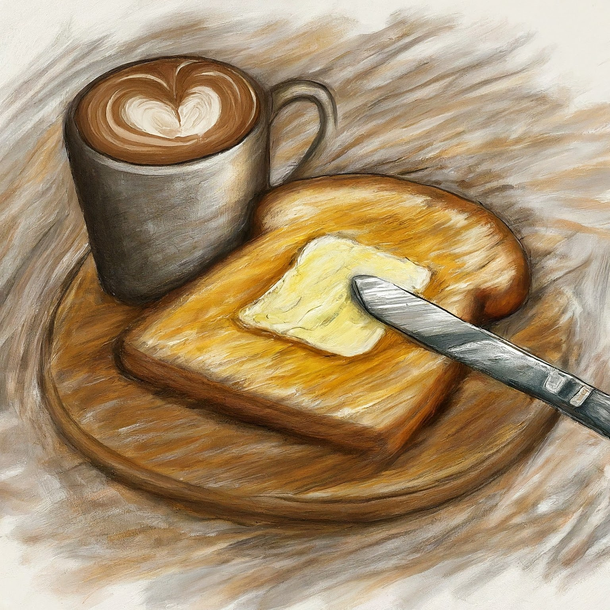
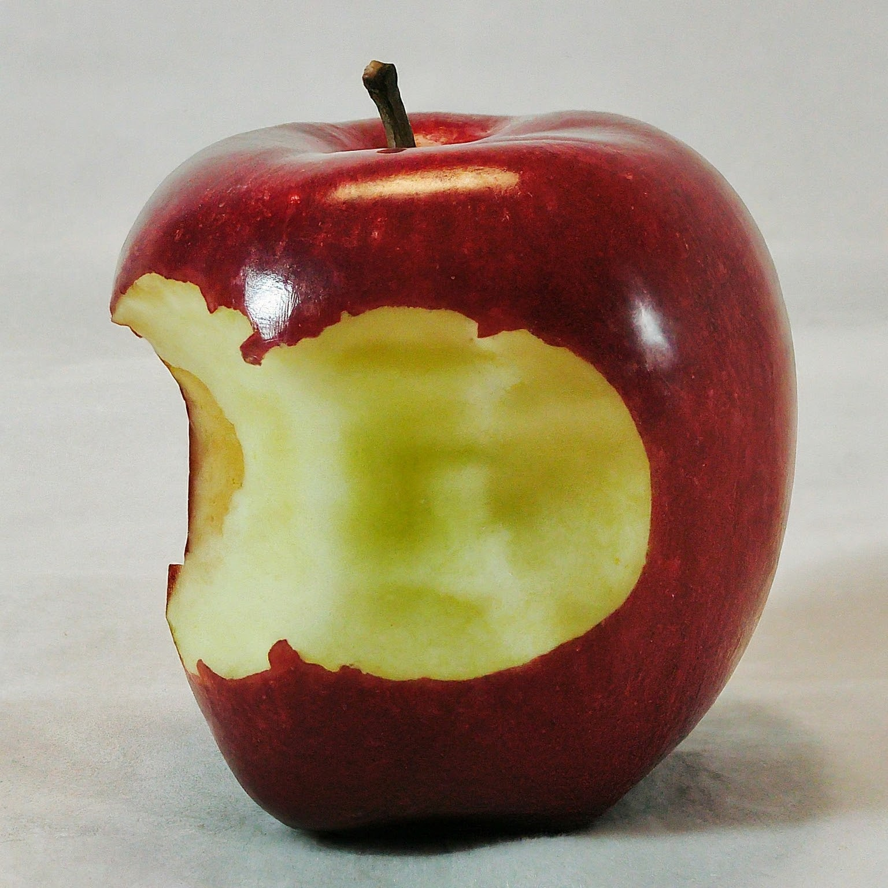

# ¿Qué puedes hacer en 10 minutos? {data-auto-animate="true"}
## Puedes beber un tazo de cafe. {data-auto-animate="true"}

## Puedes comer una manzana. {data-auto-animate="true"}

## Puedes llamar a un amigo por teléfono {data-auto-animate="true"}
:::{.story}

:::

Ella llama a un amigo por teléfono

## Puedes conocer a alguien {data-auto-animate="true"}

# ¡Juan tiene 10 minutos!
## ¡Juan tiene 10 minutos!
:::{.story}
Cada mañana☀️, Juan se despierta a las 6:00 de la mañana☀️ para ir a la escuela🏫. 

Cada tarde, Juan va a casa a las 6:00 de la tarde⌛.

*06:00 h*

*18:00 h*

:::

## ¡Juan tiene 10 minutos!
:::{.story}
Hoy es lunes, pero Juan no se despierta a las 6:00 de la mañana. A las 6:00 de la mañana, Juan duerme 😴. ¡Ay dios mío! 🤯

¡Juan tiene que ir a la escuela en 10 minutos!

*¿Cuándo se despierta?*

*¿A qué hora se despierta?*

:::

## ¡Juan tiene 10 minutos!
:::{.story}
Juan corre 🏃 a su carro🚘 y va muy rapido💨. Ve 👀 a una chica 👧 en frente de su carro.

La chica tiene ropa azul👗. Ella es una estudiante. 

*¿Quién es el profesor?*

*¿Cómo se llama la estudiante?*

:::

## ¡Juan tiene 10 minutos!
:::{.story}

*¿Dónde está Juan?*

*¿Dónde está la estudiante?*

:::
