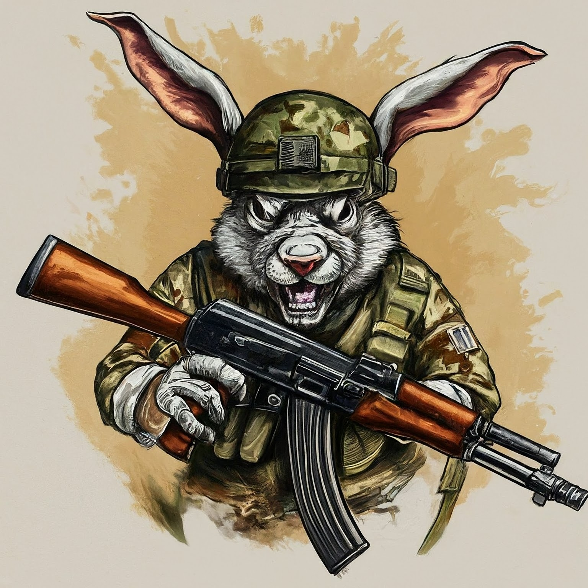
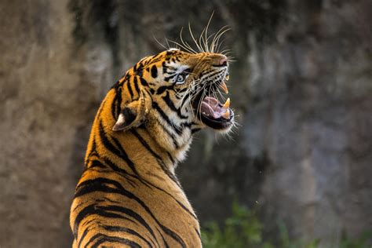
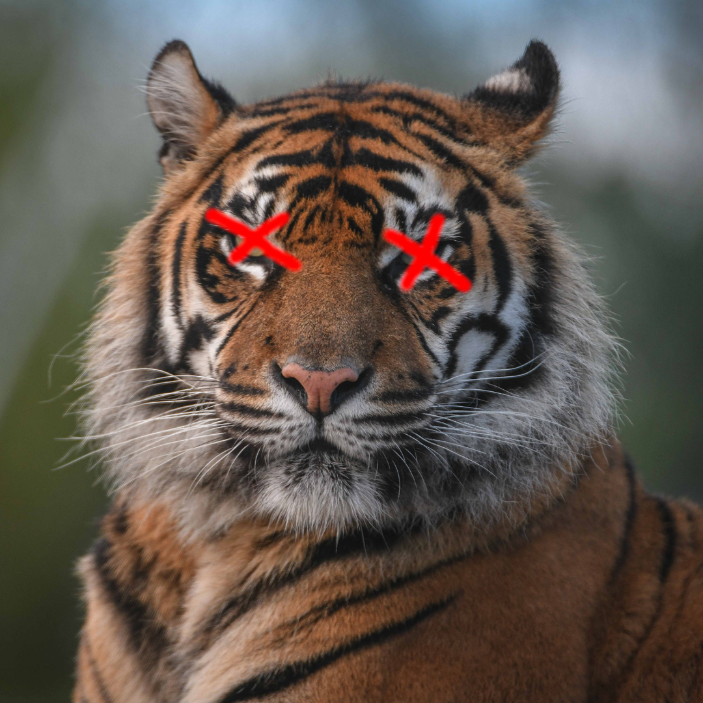

# Rules {data-auto-animate="true"}

## Rules {data-auto-animate="true"}
1. When I say “Class,” you say “Yes?”
1. When I tell you something, you say “Ohhh” 😯
1. No doing homework
1. No sleeping 😴

# We're "gonna hafta" watch another video

# Then we're "gonna" play Jeopardy. 

# Stories 
## Pick a Story
:::{.center-text}
[C1-Story](#c1-story)\
[C2-Story](#c2-story)\
[C3-Story](#c3-story)\
[C4-Story](#c4-story)\
[C5-Story](#c5-story)\
[C6-Story](#c6-story)\
[C7-Story](#c7-story)\
[C8-Story](#c8-story)
:::

# C1 Story
## C1 Story
:::{.story}
There is a student named Miki. Miki is in a small house in a forest. One day, Miki goes into the forest because she wants to go to the lake. There is a mini green duck in the lake. The duck has no eyes, so the duck is blind. Kobe is swimming with the duck. He is the duck's dog and helper. The duck can talk. He says "Kobe is my eyes." Miki says "...Huh? A talking duck?!"
:::

# C2 Story
## C2 Story
:::{.story .leftcol}
There is a student named Baby. Baby is in a small house in a forest. Baby goes out to look for something. She goes back into her house. She goes back out again. She goes back in and out three times. She sees a wolf. *\~Lucky\~* she's hungry. She wants to eat the wolf. 
:::

:::{.story .rightcol}
She goes back in the house *\~again\~* because she wants a knife so she can eat the wolf. 

OH NO the wolf went away. She goes inside *AGAIN* to get her shoes so she can *track* the wolf. The wolf *leads* her to a vineyard.
:::

:::{.story .center-bottom}
*Baby does not eat grapes because wolves are more delicious. *
:::

# C3 Story 
## C3 Story 
:::{.story}
There is a student named Evia. Evia is in a small house in a forest. Her house is in the center of France in a vineyard underground. She grows grapes and makes excellent elephant wine.
:::

## Elephant Wine?
Evia is blind. She has a *guide elephant*. Her guide elephant is her eyes. She gets on top of her guide elephant and they go to a big elevator. The elevator takes Evia and her guide elephant underground. Evia gets off her guide elephant, which is named *Tiger*, and leads the elephant to a big barrel of grapes. The elephant steps on the grapes. That's why it's called "Elephant Wine".

# C4 Story
## C4 Story
:::{.story .leftcol}
There is a student named Teresa. Teresa is in a small house in a forest. Teresa wants to explore the forest. Teresa found a rabbit. She wants to bake it. The rabbit does not want to be baked. The rabbit has a gun (it is an AK-47)! The rabbit uses his AK-47 to shoot at Teresa.
:::

:::{.story .rightcol}

:::

## Oh no, she's dead {.r-fit-text .nobox style="background:black; color:white; margin-top:100px" background-color="black"}
## What to do with her body?
:::{.fragment .fade-up .story}
The rabbit drags her to a vineyard in the center of France. He digs a hole to bury her body and leaves her there...
:::

:::{.fragment .fade-up .story}
*JUST KIDDING* she's alive! It was just a 60-second advertisement.
:::

# C5 Story
## C5 Story
:::{.leftcol}
There is a student named Simon. Simon is in a small house in a forest. Simon goes into the forest. OH NO! He sees some tigers. 

:::

:::{.rightcol}
Ethan and Corry are in the forest too because they want to hunt tigers. Corry has a gun, but Ethan does not have a gun because he wants to make a rifle himself in the forest. When Corry sees the tigers, he shoots one! 
:::

## Ethan did not shoot a tiger. 
But Ethan did not shoot a tiger because he is slow at making a gun himself. Now Jack is here. OMG, he's so hungry, but he doesn't want to shoot anything because he hates guns. He saw that Corry had just killed a tiger, so he begged: "PLEASE, Corry! Please let me have a piece of your tiger to eat! I am so hungry!" 

## The tigers are maaaaad 😡
:::{.story .leftcol}
Ethan made his gun, but there is a problem. He does not make a rifle! He made an RPG! (How???) He does not want an RPG, he wants a rifle! 
:::

:::{.story .rightcol}
The tigers see Corry shoot their friend, so the tigers are mad! (Oh no!) Everyone runs away from the tigers. 

:::

## The Tigers are Sloooow 😌
:::{.story .leftcol}

:::

:::{.story .rightcol}
The tigers are slow because one tiger is blind (he has no eyes), and the other tiger has no tail. /(Not very 跑得快.)/ Because the tigers are not fast, everyone gets away. Everyone runs until they are tired. 
:::

# C6 Story
## C6 Story
:::{.story}
Once upon a time, there was a student named Simone. Simone lived in a small house beside a forest. One day, Simone decided to explore the forest... Simone was hungry, so she looked around and found a fruit tree. But OH NO, a tiger was there! She ignored the tiger while she chopped down the tree, which was a banana tree. Fortunately, the tiger likes bananas, so she *distracts* the tiger with a banana. The tiger takes the banana, and now it can talk. The tiger leads Simone to a little house, where Amy is waiting along with a lot of treasure. The tiger starts coughing; oh no! He was allergic to bananas so he suddenly dies. 
:::

## Oh no, they're sick
:::{.story}
Amy and Simone are hungry so they eat the tiger, but they forgot to cook it, so they get sick and throw up. It was **not** *easy peasy lemon squeezy*.       
:::

# C7 Story
## C7 Story
:::{.story}
There is a student named Eric. Eric is in a small house in a forest. Eric goes into the forest. He does not like the forest. He *prefers to* go to the toilet. But he cannot find the toilet because he is *blind*. He is blind because his teacher got angry at him for his bad *marks* and *poked* his eyes! So now he has an animal to help him. 
:::

# C8 Story
## C8 Story
:::{.story}
There is a student named Jerry. Jerry lives in a small house in the forest, and he went into the forest. Jerry does not want to be in the forest; he wants to play videogames, but he doesn't have any videogames because he's in the forest. 
:::

## Videogames
:::{.story}
Kobe Bryant has a videogame. He has Mario, and he does not want to go to the forest because it is too big. He prefers to play videogames at home. But Kobe Bryant is so *nice*! He goes to the forest, *even though* it is so big, because he wants to give Mario to Jerry. He goes to the forest, even though it is so big, because he wants to give Mario to Jerry. Jerry loves Mario because it is an excellent game. Jerry gives Kobe a bottle of wine to say thanks. 
:::

